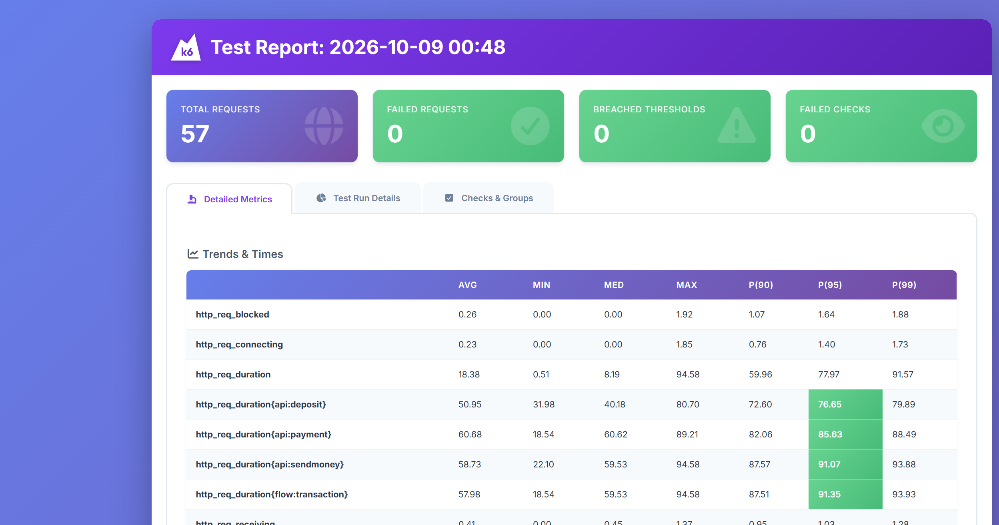
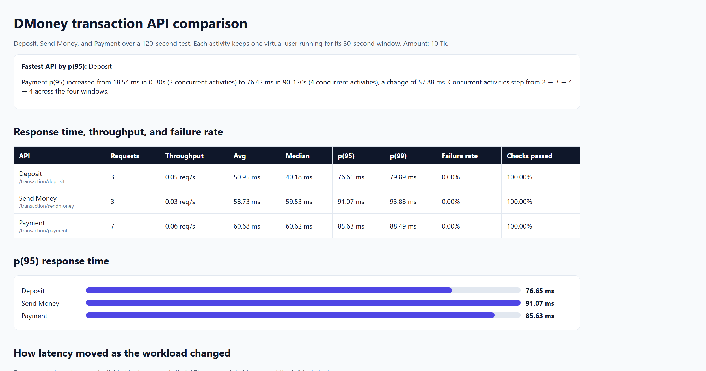

# DMoney Performance Testing with K6 🚀

DMoney Performance Testing is a JavaScript-based performance test suite built with **k6**. It simulates six DMoney users (2 Agents, 2 Customers, 2 Merchants) performing **Deposit**, **Send Money** and **Payment** transactions concurrently for **2 minutes**, and compares the three APIs on response time, throughput, failure rate and performance degradation.

## 🎯 Purpose

- Simulate a realistic 4-window transaction flow where activities in the same window run **concurrently and continuously** for the whole window
- Authenticate every user with **their own credentials**
- Validate every transaction response with k6 **checks**
- Enforce global and **per-API thresholds** (Deposit, Send Money, Payment)
- Observe how latency changes as the concurrent workload grows

---

## 🔗 System Under Test

- **DMoney API:** `http://localhost:5000`
  - `POST /transaction/deposit`
  - `POST /transaction/sendmoney`
  - `POST /transaction/payment`

---

## ✅ What Gets Tested

| Window | Concurrent activities |
| ------ | --------------------- |
| 0–30s | Customer 1 → Send Money → Customer 2 · Customer 2 → Payment → Merchant 1 |
| 30–60s | Customer 2 → Send Money → Customer 1 · Agent 1 → Deposit → Customer 2 · Customer 1 → Payment → Merchant 1 |
| 60–90s | Agent 1 → Deposit → Customer 1 · Agent 2 → Deposit → Customer 2 · Customer 1 → Send Money → Customer 2 · Customer 2 → Payment → Merchant 2 |
| 90–120s | Agent 1 → Payment → Merchant 1 · Agent 2 → Payment → Merchant 2 · Customer 1 → Payment → Merchant 1 · Customer 2 → Payment → Merchant 2 |

Each activity is one k6 scenario (`constant-vus`, 1 VU) that sends a request every second for its whole window.

---

## ✨ Features

- One k6 scenario per activity, started with `startTime` so each window begins on time
- Per-user login (with OTP read through a small local bridge)
- Tags per API (`api`) and per window (`phase`) with matching thresholds
- Console logging of every transaction and its response time
- Auto-generated **HTML report** (`k6-reporter`) and a custom **API comparison report**

---

## 🛠️ Technologies Used

- [k6](https://k6.io/) (Grafana k6)
- JavaScript (ES6) · Node.js (OTP bridge)
- [k6-reporter](https://github.com/benc-uk/k6-reporter)

---

## 📁 Project Structure

```
dMoney-Performance-Testing-with-K6/
├── dMoneyTest.js            # k6 test: setup, 4 windows, checks, thresholds
├── otpBridge.js             # Reads OTP codes from the API log
├── reports/
│   ├── dMoneyReport.html        # k6 HTML report
│   └── dMoneyComparison.html    # API comparison report
├── screenshots/
│   ├── k6-html-report.png
│   └── api-metrics.png
└── .gitignore
```

---

## ⚙️ Local Installation

1. Clone the repository:

```bash
git clone https://github.com/tash-9/dMoney-Performance-Testing-with-K6
cd dMoney-Performance-Testing-with-K6
```

2. Install k6: https://k6.io/docs/get-started/installation/

3. Install Node.js (needed for the OTP bridge).

---

## ▶️ Running the Test

1. Start the DMoney API with its log written to `logs/api.log`:

```bash
mkdir logs
node server.js > logs/api.log 2>&1
```

2. Start the OTP bridge:

```bash
OTP_LOG=logs/api.log node otpBridge.js
```
(PowerShell: `$env:OTP_LOG = "logs\api.log"; node otpBridge.js`)

3. Run the test:

```bash
k6 run dMoneyTest.js
```

| Variable | Default | Purpose |
| -------- | ------- | ------- |
| `BASE_URL` | `http://localhost:5000` | DMoney API |
| `AMOUNT` | `10` | Amount of each transaction |
| `CUSTOMER_FUND` | `2000` | Opening balance given to each customer |

Setup (not measured) creates and activates the 6 users, logs each in, funds both agents from `SYSTEM`, and deposits to both customers. The measured 2 minutes start after that.

---

## 📊 Validations (Checks)

Every transaction response is checked for:

- HTTP status is **201**
- Transaction request is **successful**
- **Transaction ID** (`trnxId`) is returned
- Expected **success message** (`Deposit successful` / `Send money successful` / `Payment successful`)

## 🚦 Thresholds

| Scope | Failed rate | p(95) | Checks |
| ----- | ----------- | ----- | ------ |
| All transactions | < 1% | < 1000ms | > 99% |
| Deposit | < 1% | < 1000ms | > 99% |
| Send Money | < 1% | < 1000ms | > 99% |
| Payment | < 1% | < 1000ms | > 99% |

---

## 📈 Results

### HTML Report



Full report: [reports/dMoneyReport.html](https://htmlpreview.github.io/?https://github.com/tash-9/dMoney-Performance-Testing-with-K6/blob/main/reports/summary.html)

### Metrics



Window-by-window numbers: [reports/dMoneyComparison.html](https://htmlpreview.github.io/?https://github.com/tash-9/dMoney-Performance-Testing-with-K6/blob/main/reports/comparison.html)

---

## 📝 Notes

- Activities in the same window run as parallel scenarios and keep sending requests (1 request/second per user) until the window ends.
- Throughput is requests divided by the seconds that API was scheduled to run.
- The OTP bridge is needed because Agent, Customer and Merchant logins require an OTP printed in the API log.

---

## ✍️ Author
Tasfia Islam Raisha
